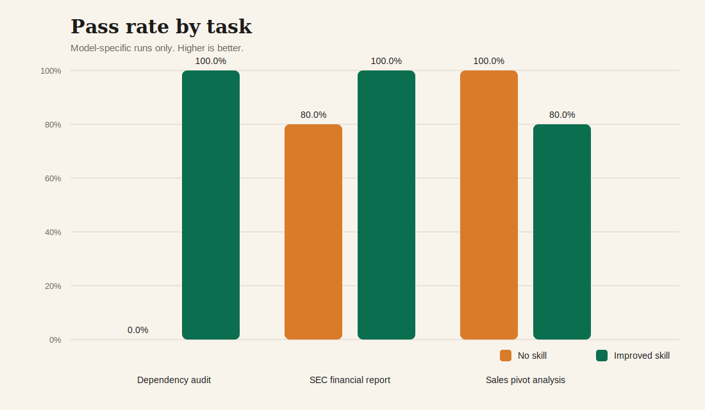
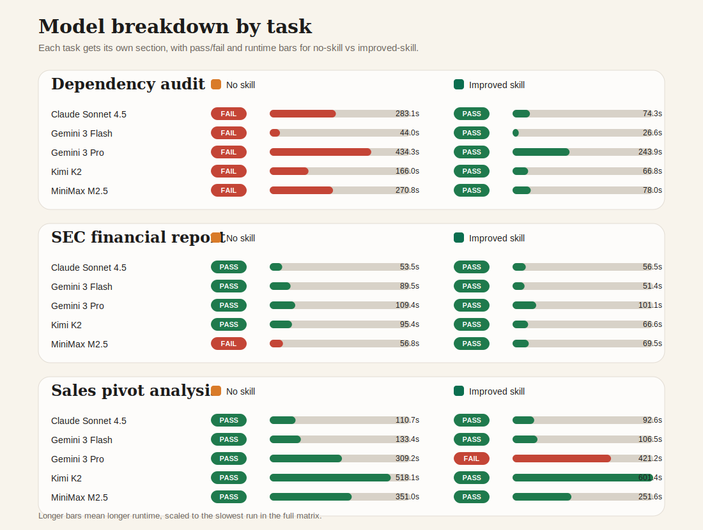

# Evaluating Skills - A Starter

This repository is a starting point for evaluating skills. It shows a simple workflow: run a task without a skill, run it again with a skill, verify the output locally, and compare the results. From here, you can move to more complex methods for evaluating skills.

The examples are adapted from [SkillsBench](https://github.com/benchflow-ai/skillsbench), but the goal here is not to recreate a full benchmark harness. The goal is to give you a practical starting point for testing your own skills with OpenHands Cloud or a local agent server. All the code can be run in your local environment, and if you want to use an open source observability platform like Laminar, just add your key.

Current task examples:

- `software-dependency-audit`
- `sec-financial-report`
- `sales-pivot-analysis`

Outcomes:

This repo helps you assess three distinct task examples. You can see overall performance, performance by model, and traces. As you go through these, you will see that sometimes adding a skill leads to large improvements, sometimes marginal improvement, and on occasion a skill can be counterproductive. I intentionally chose these examples to broaden your thinking about skill evaluation.





- For a deeper dive into evaluating skills, check out [docs/METHODOLOGY.md](docs/METHODOLOGY.md)
- To add a new task, follow [docs/ADDING_A_TASK.md](docs/ADDING_A_TASK.md)

## Quickstart

You can run this on OpenHands Cloud or with a local OpenHands Agent:

Requirements:

- Python 3.12+
- `uv`
- OpenHands credentials
- Docker Desktop if you want the local agent-server path

Install:

```bash
uv sync
```

Choose a routed model:

```bash
export LLM_MODEL=openhands/claude-sonnet-4-5-20250929
```

For OpenHands Cloud:

```bash
export OPENHANDS_CLOUD_API_KEY=...
```

- `OPENHANDS_CLOUD_API_KEY`: your OpenHands Cloud API key
  https://docs.openhands.dev/openhands/usage/cloud/cloud-api
- `GitHub token`: create a token with `repo` scope if you are using a token-based GitHub connection for repo-backed Cloud runs
  https://docs.openhands.dev/usage/cloud/github-installation

For the local agent-server path:

```bash
export LLM_API_KEY=...
```

- `LLM_API_KEY`: your OpenAI, Anthropic, or OpenHands LLM key
  https://docs.openhands.dev/openhands/usage/settings/api-keys-settings

Optional tracing using Laminar:

```bash
export LMNR_PROJECT_API_KEY=...
```

## OpenHands Cloud

This is the main tutorial path.

Run against the GitHub repo directly:

```bash
uv run python scripts/run_sec_financial_report_eval.py \
  --backend cloud \
  --execution-mode repo \
  --condition no-skill \
  --cloud-repo rajshah4/evaluating-skills-tutorial

uv run python scripts/run_sec_financial_report_eval.py \
  --backend cloud \
  --execution-mode repo \
  --condition improved-skill \
  --cloud-repo rajshah4/evaluating-skills-tutorial
```

The same pattern works for `sales-pivot-analysis`:

```bash
uv run python scripts/run_sales_pivot_eval.py --backend cloud --execution-mode repo --condition no-skill --cloud-repo rajshah4/evaluating-skills-tutorial
uv run python scripts/run_sales_pivot_eval.py --backend cloud --execution-mode repo --condition improved-skill --cloud-repo rajshah4/evaluating-skills-tutorial
```

Each task has a thin wrapper script in `scripts/` so the tutorial reads like one evaluation per task instead of one giant command with `--task` everywhere. If you add your own task, copying one of these wrappers is the simplest way to create a task-specific entrypoint while still reusing the shared engine in `scripts/run_eval.py`.

**Note on `software-dependency-audit`:** This task requires separate conversations for skill vs no-skill testing to avoid leakage of the pinned Trivy report. The OpenHands CLI handles this correctly, or use the local agent-server for proper skill comparison.

Skills are authored next to each task under `tasks/<task>/skills/<variant>/SKILL.md`. After editing task-local skills, regenerate the compatibility copies used by Cloud V1 and AGENTS with:

```bash
uv run python scripts/sync_skills.py
```

## Local

Use a local agent server when you want a local runtime with a similar client-to-server shape.

Start the server:

```bash
./scripts/start_local_agent_server.sh
```

Run an evaluation:

```bash
uv run python scripts/run_sec_financial_report_eval.py \
  --backend agent-server \
  --execution-mode repo \
  --condition improved-skill
```

For `software-dependency-audit`, use the default upload mode locally as well:

```bash
uv run python scripts/run_dependency_audit_eval.py --backend agent-server --condition no-skill
uv run python scripts/run_dependency_audit_eval.py --backend agent-server --condition improved-skill
```

Recommended local env vars:

```bash
export OPENHANDS_AGENT_SERVER_URL=http://127.0.0.1:8000
```

For the exact local setup, see [IMPLEMENTATION.md](IMPLEMENTATION.md).

Validated live after the task-local skill refactor:

- `uv run python scripts/run_dependency_audit_eval.py --backend cloud --condition improved-skill`
- `uv run python scripts/run_sec_financial_report_eval.py --backend agent-server --execution-mode repo --condition improved-skill`
- `uv run python scripts/run_sales_pivot_eval.py --backend agent-server --execution-mode repo --condition improved-skill`

## Verify And Compare

Verify a saved run:

```bash
uv run python verify.py --task software-dependency-audit /path/to/report.json
uv run python verify.py --task sec-financial-report /path/to/answers.json
uv run python verify.py --task sales-pivot-analysis /path/to/result.xlsx
```

Generate summaries and visuals:

```bash
uv run python scripts/compare_runs.py
uv run python scripts/export_metrics_summary.py
uv run python scripts/generate_visuals.py
```

Included outputs:

- [summary csv](results/fresh_matrix_summary.csv)
- [summary json](results/fresh_matrix_summary.json)
- [dashboard](results/visuals/index.html)

## Run Multiple Models

If you want to compare across multiple models, you can easily do that. The examples here use OpenHands-routed models in the format `openhands/<model>`.

Validated examples:

- `openhands/claude-sonnet-4-5-20250929`
- `openhands/minimax-m2.5`
- `openhands/gemini-3-pro-preview`
- `openhands/gemini-3-flash-preview`
- `openhands/kimi-k2-0711-preview`

Example:

```bash
uv run python scripts/run_model_matrix.py \
  --task sec-financial-report \
  --backend agent-server \
  --condition improved-skill \
  --model openhands/claude-sonnet-4-5-20250929 \
  --model openhands/minimax-m2.5 \
  --model openhands/gemini-3-pro-preview \
  --model openhands/gemini-3-flash-preview \
  --model openhands/kimi-k2-0711-preview
```

## Observability

This tutorial uses Laminar as the example tracing backend, but the evaluation loop is not tied to Laminar. Traces help explain behavior; the verifier decides correctness. OpenHands is OTEL-compatible, so you can use the observability tool of your choice.

## Acknowledgements

This tutorial is inspired by SkillsBench and reuses its core idea of evaluating skills on deterministic tasks with local verifiers.

- Paper: https://arxiv.org/abs/2602.12670
- GitHub: https://github.com/benchflow-ai/skillsbench
