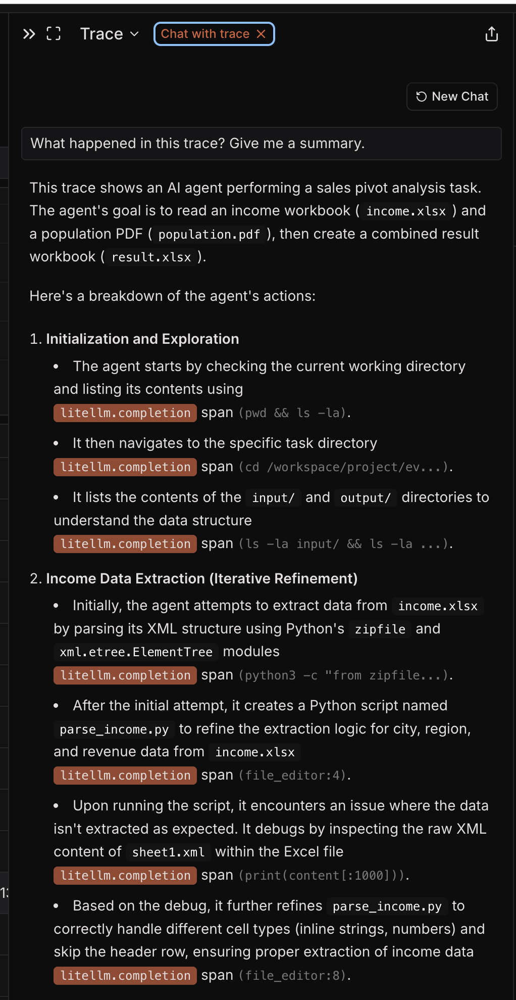

# How to Evaluate Agent Skills (And Why You Should)

Skills are becoming a core building block for AI coding agents. Research is documenting the utility of skills, for example [SkillsBench](https://arxiv.org/abs/2602.12670) found across varied tasks an improvement of 16.2 percentage points. At OpenHands, we wrote about [creating effective agent skills](https://openhands.dev/blog/20260227-creating-effective-agent-skills), covering how to package domain knowledge into reusable workflows and evaluating those workflows.

This post and accompanying repo dive deeper into the evaluation of skills, with three task examples adapted from [SkillsBench](https://github.com/benchflow-ai/skillsbench) to give you a hands-on way to run evaluations and see results yourself.

## Why evaluate skills?

If skills just codify knowledge, why bother evaluating them?

It turns out, poorly written skills can reduce performance. [SkillsBench](https://arxiv.org/abs/2602.12670) tested 86 tasks across 11 domains and found skills generally improved agent performance. However, in 16 out of 84 tasks, skills showed negative deltas, meaning the skill actually made things worse.

Secondly, as models continue to grow in capability, you may not need a skill. Boris Cherny, a developer on Claude Code, [puts it](https://www.youtube.com/watch?v=PQU9o_5rHC4&t=611s):

> "The capability changes with every model. The thing that you want is do the minimal possible thing in order to get the model on track. Delete your claude.md and then, if the model gets off track, add back a little bit at a time. What you're probably going to find is with every model you have to add less and less."

Third, models differ in their abilities. A skill that one model needs may be unnecessary, or even harmful, for another. This is why this post covers evaluating skills across multiple models.

## How would you evaluate a skill?

Skill evaluation starts with picking the right tasks. Not every task is a good candidate. The best tasks have three properties:

1. **Bounded scope**: the agent can finish in one run, and a human can understand what success looks like
2. **Deterministic verification**: you can write a verifier that says pass or fail without subjective judgment
3. **A real procedural gap**: the task rewards having the right workflow, not just general knowledge

That last point is where skills matter most. Skills encode *how* to do something: which tool to use, what order to operate in, what edge cases to handle. If the task is just "answer a knowledge question," a skill probably won't help much.

The most common evaluation mistake is running only the skill-enabled version of a task and assuming success means the skill was valuable. It doesn't. If the agent would have succeeded without the skill, you haven't demonstrated anything. So how do you actually test whether a skill helps? Compare with and without:
- **No-skill**: the agent attempts the task with no procedural guidance
- **Skill-enabled**: the agent gets the skill injected into its context

Beyond pass/fail, secondary metrics like runtime, event count, and number of tool calls tell you whether a skill made the agent more *efficient*, even when both conditions succeed.

## How we evaluated skills

I built the [evaluating-skills-tutorial](https://github.com/rajshah4/evaluating-skills-tutorial) repo with three tasks that each tell a different story. Each task has a deterministic verifier, a no-skill baseline, and an improved skill variant. The tasks are intentionally varied: one where the skill is essential, one where it helps marginally, and one where it can actually hurt.

We ran each task with and without the skill across five models - Claude Sonnet 4.5, Gemini 3 Pro, Gemini 3 Flash, Kimi K2, and MiniMax M2.5 - using both [OpenHands Cloud](https://docs.openhands.dev/openhands/usage/cloud/cloud-api) and the open source [local agent server](https://github.com/rajshah4/evaluating-skills-tutorial/blob/main/IMPLEMENTATION.md). All results are committed to the repo so you can reproduce or compare against them.

## Three tasks, three different stories

### Task 1: Software Dependency Audit

**The task**: Scan a `package-lock.json` for HIGH and CRITICAL vulnerabilities and produce a structured `report.json`.

**Why it's interesting**: Without guidance, agents tend to improvise. They'll try to install vulnerability scanners, use whatever database is available, and include LOW/MEDIUM findings. The result? Reports with 14-34 findings when the correct answer is 3.

**The improved skill** encodes a specific workflow:
- Check for a pinned offline Trivy snapshot first
- Use offline scanning to avoid database drift
- Filter to HIGH/CRITICAL only
- Extract CVSS scores in a specific priority order (NVD > GHSA > Red Hat)
- Sort findings deterministically

**Results**:

| Condition | Pass Rate | Avg Runtime | Avg Events |
|-----------|-----------|-------------|------------|
| No-skill | 0% (0/10) | 266s | 53 |
| Improved-skill | 100% (10/10) | 109s | 22 |

This is the clearest win. Without the skill, *no model* gets the right answer. With the skill, *every model* passes, typically in half the time with less than half the events. The skill eliminates the trial-and-error of figuring out the right workflow.

### Task 2: SEC Financial Report

**The task**: Read two quarterly financial reports (Q2 and Q3) and extract metrics like revenue, net income, and growth percentages into a structured `answers.json`.

**Why it's interesting**: This is a task most models can already handle. The data is right there in the files.

**The improved skill** provides:
- Explicit formulas for computing growth percentages
- Guardrails against fetching external data
- Instructions to use Python for arithmetic instead of doing it in-head

**Results**:

| Condition | Pass Rate | Avg Runtime |
|-----------|-----------|-------------|
| No-skill | 90% (9/10) | 87s |
| Improved-skill | 100% (10/10) | 99s |

The skill improves reliability. MiniMax M2.5 fails without the skill on one backend but passes with it on both. For most models, the task is already solvable. This is the "skill as safety net" pattern: the value is in consistency across models, not in unlocking a capability that was previously impossible.

### Task 3: Sales Pivot Analysis

**The task**: Combine data from an Excel workbook and a PDF into a new workbook with two sheets (`CombinedData` and `Summary`), including derived metrics like revenue per capita.

**Why it's interesting**: This is where skills get tricky.

**The improved skill** provides detailed no-install parsing patterns (using `zipfile` and `xml.etree.ElementTree` for Excel, `strings` for PDF extraction) and exact sheet structure guidance.

**Results**:

| Condition | Pass Rate |
|-----------|-----------|
| No-skill | 70% (7/10) |
| Improved-skill | 80% (8/10) |

Overall, the skill helps slightly. But look at the per-model breakdown:

- **Gemini 3 Pro**: no-skill passes on agent-server, but *fails* on cloud without skill, then passes with skill on cloud. Mixed signal.
- **Claude Sonnet 4.5**: passes no-skill on both backends, but *fails* improved-skill on cloud. The skill made it worse.
- **Kimi K2**: fails no-skill on both backends, but passes improved-skill on cloud. The skill helps, but only on one backend.

**Skills can be counterproductive.** The sales pivot skill pushes models toward a specific parsing path (zipfile/XML) that, for some models, is more brittle than whatever they would have done on their own.

"Improved" is only a hypothesis until it's measured. The sales pivot result is a concrete, reproducible example of that.

## The overall picture

Three tasks, three different stories:
1. **Dependency audit**: Skill is essential. 0% to 100%.
2. **Financial report**: Skill is a safety net. 90% to 100%.
3. **Sales pivot**: Skill helps some models, hurts others. Net improvement is marginal.

Single-task evaluation misses this nuance. If you only tested the dependency audit, you'd conclude skills are transformative. If you only tested the financial report, you'd conclude they're nice-to-have. If you only tested the sales pivot, you might conclude they're harmful.

## What traces tell you (and what they don't)

Pass/fail tells you the outcome, but traces tell you the story. Good AI engineering practice means looking at the data, and traces give you the rich detail behind what the agent actually did. The verifier decides correctness; traces help you understand *why*.

Here's an example trace from a sales pivot analysis run, viewed in Laminar:

This trace shows the agent working through the sales pivot task step by step. You can see each `litellm.completion` span. The agent starts by exploring the directory structure, then attempts to extract data from `income.xlsx` by parsing its XML structure with `zipfile` and `xml.etree.ElementTree`. It creates a helper script (`parse_income.py`), hits an issue where data isn't extracted as expected, debugs by inspecting the raw XML content of `sheet1.xml`, and iteratively refines the extraction logic to handle different cell types and skip header rows.

The trace reveals how many iterations the agent needed, where time was spent (here, debugging XML cell type handling), and whether the skill's prescribed path was actually followed.

Some patterns worth looking for in traces:

**Workflow divergence**: In the dependency audit, no-skill traces show agents trying multiple approaches: installing `npm audit`, attempting to download vulnerability databases, manually parsing the lockfile. The improved-skill traces show a clean, linear path: check for the snapshot, copy it, parse, filter, write. The skill eliminates exploration.

**Wasted effort**: In the sales pivot no-skill runs that still pass, you'll often see agents spending many events installing packages, hitting errors, retrying with different approaches, and eventually succeeding. The skill-enabled runs that pass tend to take a more direct path. But when the prescribed path doesn't work for a particular model, the agent may not recover as well as it would have on its own.

**The value of failure traces**: Some of the most useful traces are the ones where the skill-enabled run *fails*. These tell you where your skill is overconstrained or where it assumes capabilities the model doesn't have. The Claude Sonnet 4.5 sales pivot failure on cloud is a good example: the skill's no-install parsing guidance may have pushed the model away from a simpler approach that would have worked.

We used [Laminar](https://www.lmnr.ai/) for tracing in this tutorial, but the evaluation loop isn't tied to any specific observability platform. OpenHands is OTEL-compatible, so you can plug in whatever you prefer.

## Try it yourself

The repo includes everything you need: task definitions, skills, verifiers, evaluation scripts, and committed results you can compare against. You can run quickly using the OpenHands cloud or run it locally on your machine. You can also add your own tasks following the [guide in the docs](https://github.com/rajshah4/evaluating-skills-tutorial/blob/main/docs/ADDING_A_TASK.md).

---

*This tutorial is inspired by [SkillsBench](https://github.com/benchflow-ai/skillsbench) and reuses its core idea of evaluating skills on deterministic tasks with local verifiers. The three example tasks are adapted from the SkillsBench task set.*
